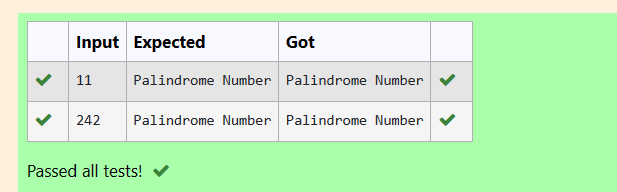
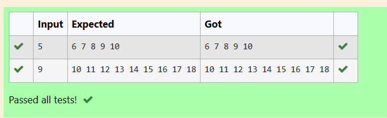

# EX2(B)Loops Application
Developed by: ARSHITHA MS

Register number: 212223240015
 ## AIM:
 To write a program to find pallindrome number and to print the Addition table.

 ## ALGORITHM:
 1.Start the program

 2.Declare the variables

 3.Get input from the user.

 4.Use while loop for both the programs.
 
 5.Print the output.

 6.End the program

 
 ## PROGRAM
 ### Program 1:
 ```
#include <stdio.h>
int main()
{
    int n,k,new=0;
    scanf("%d",&n);
    k=n;
    while (n>0)
    {
        new=new*10;
        new=new+(n%10);
        n=n/10;
    }
    if (new==k)
    {
        printf("Palindrome Number");
    }
    
    else
    {
        printf("Not a Palindrome Number");
    }
    
}
```
### Program 2:
```
#include<stdio.h>
int main()
{
    int n,i=1;
    scanf("%d",&n);
    while(i<=n)
    {
        printf("%d ",n+i);
        i+=1;
    }
}
```

## OUTPUT:
### Output 1:



### Output 2:


## RESULT:
Thus the program to find pallindrome number and to print the Addition table is executed successfully.